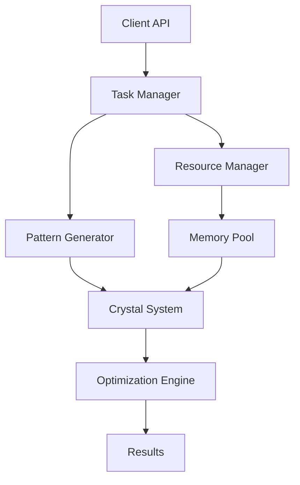

# Prism Architecture Documentation
Created by: isdood
Date: 2025-01-21 11:26:26 UTC

## Overview

Prism is a high-performance crystal pattern simulation system implemented in Rust and Zig. The architecture follows a modular design with clear separation of concerns, focusing on efficient task execution and crystal pattern management.

## Core Components

### 1. Runtime System (`runtime/`)
- Task scheduling and execution
- Async operation management
- Resource allocation and deallocation
- Thread pool management
- Priority-based execution

```rust
Runtime {
    executor: TaskExecutor,
    thread_pool: ThreadPool,
    task_queue: PriorityQueue<Task>,
}
```

### 2. Crystal System (`crystal/`)
- Crystal structure management
- Node positioning and relationships
- Pattern generation and manipulation
- Stability calculations
- Optimization algorithms

```rust
Crystal {
    system: CrystalSystem,
    nodes: Vec<Node>,
    patterns: HashMap<PatternId, Pattern>,
    stability_cache: Cache<StabilityMetrics>,
}
```

### 3. Pattern Management (`pattern/`)
- Pattern definition and generation
- Resonance pattern handling
- Pattern transformation
- Pattern optimization

```rust
Pattern {
    config: PatternConfig,
    nodes: Vec<PatternNode>,
    transform: Transform,
    metrics: PatternMetrics,
}
```

## Language Integration

### Rust Components
- High-level task management
- Pattern generation logic
- Crystal system core
- API interfaces

### Zig Components
- Low-level system interactions
- Performance-critical operations
- Memory management
- Platform-specific optimizations

## Data Flow



## Component Interactions

### 1. Task Execution Flow
1. Client submits task through API
2. Task Manager evaluates priority and resources
3. Task scheduled for execution
4. Resources allocated
5. Task executed
6. Results returned
7. Resources freed

### 2. Pattern Generation Flow
1. Pattern configuration received
2. Resources allocated
3. Pattern generated
4. Crystal system updated
5. Optimization performed
6. Stability verified
7. Pattern committed or rolled back

### 3. Crystal Optimization Flow
1. Current state evaluated
2. Optimization strategy selected
3. Iterative improvements applied
4. Stability checked
5. Results validated
6. Changes committed

## Performance Considerations

### Memory Management
- Custom allocators for specific use cases
- Pool allocators for frequent operations
- Memory recycling for pattern generation
- Cache-friendly data structures

### Concurrency
- Lock-free algorithms where possible
- Task-based parallelism
- Work stealing scheduler
- Atomic operations for shared state

### Optimization
- SIMD operations for calculations
- Cache-aware algorithms
- Lazy evaluation of expensive operations
- Incremental updates

## Error Handling

### Error Categories
1. Runtime Errors
   - Task execution failures
   - Resource allocation failures
   - Timeout errors

2. Crystal System Errors
   - Invalid configurations
   - Stability violations
   - Pattern generation failures

3. Resource Errors
   - Memory allocation failures
   - Thread creation failures
   - System resource exhaustion

### Error Recovery
- Automatic retry mechanisms
- Graceful degradation
- State rollback capabilities
- Resource cleanup

## Configuration

### Runtime Configuration
```rust
RuntimeConfig {
    thread_count: u32,
    stack_size: usize,
    use_hardware_threads: bool,
    memory_limit: usize,
}
```

### Crystal Configuration
```rust
CrystalConfig {
    system_type: CrystalSystem,
    optimization_level: OptimizationLevel,
    stability_threshold: f64,
    max_nodes: usize,
}
```

### Pattern Configuration
```rust
PatternConfig {
    pattern_type: PatternType,
    spacing: f64,
    scale: f64,
    rotation: [f64; 3],
    symmetry: u32,
}
```

## Testing Strategy

### Unit Tests
- Component-level testing
- Interface verification
- Error handling validation
- Performance benchmarks

### Integration Tests
- Cross-component interaction
- Resource management
- Error propagation
- System stability

### Performance Tests
- Throughput measurement
- Latency profiling
- Resource utilization
- Scalability verification

## Future Considerations

### Planned Improvements
1. Enhanced parallelization
2. GPU acceleration
3. Distributed processing
4. Advanced pattern recognition
5. Machine learning integration

### Scalability
- Horizontal scaling capabilities
- Resource pooling
- Load balancing
- State distribution

## API Documentation

### Public Interfaces
- Task submission and management
- Pattern generation and manipulation
- Crystal system operations
- Configuration and monitoring

### Integration Points
- FFI interfaces
- Language bindings
- Plugin system
- Extension mechanisms

## Security

### Data Protection
- Input validation
- Resource limits
- Access control
- State isolation

### Resource Protection
- Memory protection
- Thread isolation
- Error containment
- Resource quotas

## Monitoring and Diagnostics

### Metrics
- Task execution times
- Resource utilization
- Pattern stability
- System health

### Logging
- Error tracking
- Performance monitoring
- State changes
- Resource usage

## Deployment

### Requirements
- System dependencies
- Resource requirements
- Platform compatibility
- Installation procedure

### Configuration
- Environment setup
- Resource allocation
- Performance tuning
- Monitoring setup

## Maintenance

### Updates
- Version compatibility
- Migration procedures
- State preservation
- Rollback procedures

### Troubleshooting
- Common issues
- Diagnostic procedures
- Recovery steps
- Support resources

## References

1. Crystal System Documentation
2. Pattern Generation Algorithms
3. Performance Optimization Guidelines
4. API Reference Manual
5. Testing Documentation
